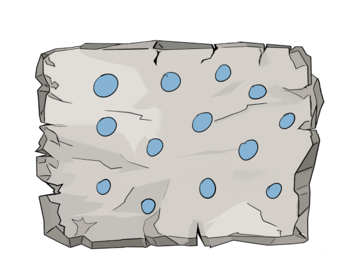
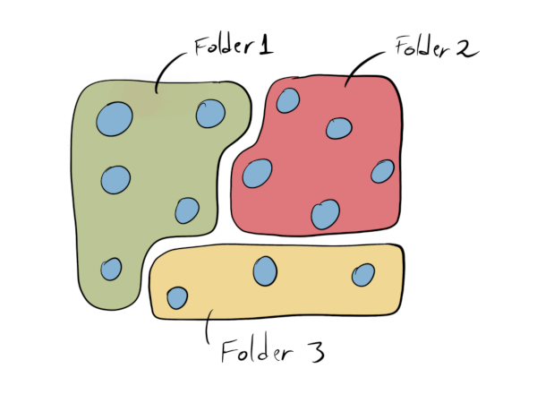
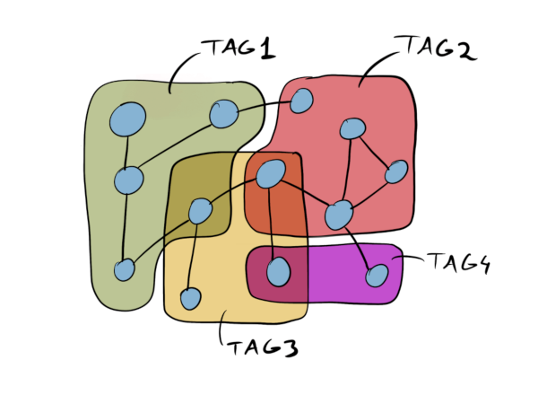
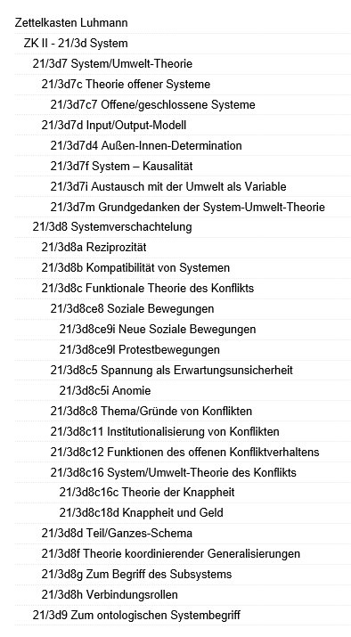
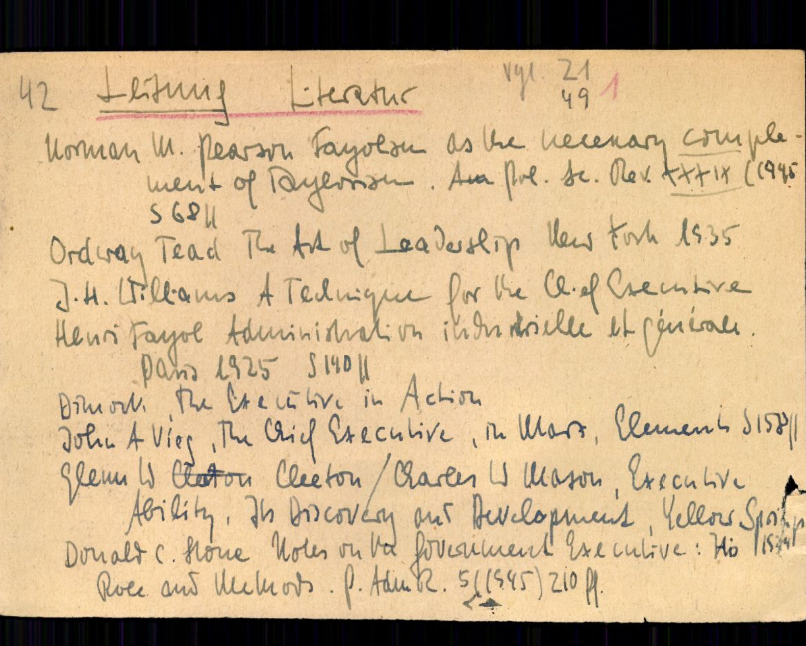
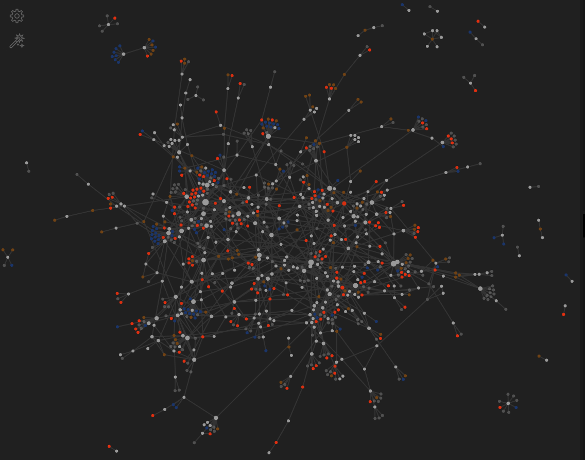

## principes de la méthode Zettelkasten
### présentation d'Obsidian
#### Damien Belvèze
#### 21 février 2021

---

La méthode Zettelkasten est une méthode de prise de notes destinée à accroître la productivité et l'inventivité et mise au point par [Niklas Luhmann](https://en.wikipedia.org/wiki/Niklas_Luhmann)(1927-1998) chercheur en sociologie à Bielefeld
Zettelkasten : petites cases

---

        
Notes prises dans la matrice (exemple : un cahier imprimé)

---

notes volantes, pas de liens (exemple : des post-its)

---

notes rangées par catégories / dossiers

---

-  Pas de rangement d'une note dans deux catégories

- Comment ranger facilement une note dans une catégorie plus récente et plus pertinente ?

---

notes rangées par tags

---

- difficulté de gérer un grand nombre de tags
- risque d'utiliser deux tags différents pour deux notes ayant le même sujet

---

 
notes rangées liées par des liens et des rétroliens

---

- pas de catégorie = plus de souplesse, pas de structure interne

- chaque note est identifiable par un identifiant unique

- dans la version électronique, pas de besoin de ranger les notes par ordre de création

---

arborescence ou horizontalité ?

---

---

